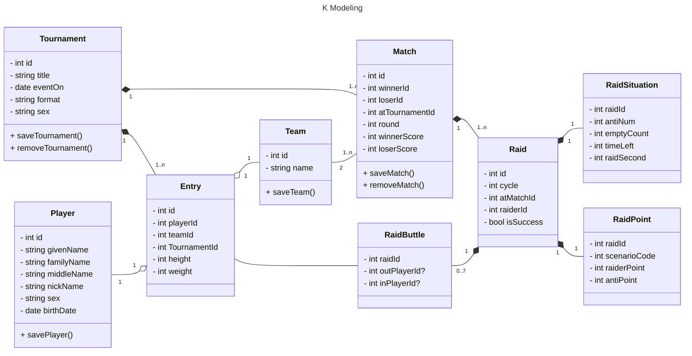

```mermaid
---
title: K Modeling
---
classDiagram
    direction LR
    class Tournament{
      - int id
      - string title
      - date eventOn
      - string format
      - string sex
      + saveTournament()
      + removeTournament()
    }
    class Match{
      - int id
      - int winnerId
      - int loserId
      - int atTournamentId
      - int round
      - int winnerScore
      - int loserScore
      + saveMatch()
      + removeMatch()
    }
    class Team{
      - int id
      - string name
      + saveTeam()
    }
    class Player{
      - int id
      - string givenName
      - string familyName
      - string middleName
      - string nickName
      - string sex
      - date birthDate
      + savePlayer()
    }
    class Entry{
      - int id
      - int playerId
      - int teamId
      - int TournamentId
      - int height
      - int weight
    }
    class Raid{
      - int id
      - int cycle
      - int atMatchId
      - int raiderId
      - bool isSuccess
    }
    class RaidPoint{
      - int raidId
      - int scenarioCode
      - int raiderPoint
      - int antiPoint
    }
    class RaidSituation{
      - int raidId
      - int antiNum
      - int emptyCount
      - int timeLeft
      - int raidSecond
    }
    class RaidButtle{
      - int raidId
      - int outPlayerId?
      - int inPlayerId?
    }

    Tournament "1" *-- "1..n" Match
    Tournament "1" *-- "1..n" Entry
    Entry "1" o-- "1" Team
    Team "2" -- "1..n" Match
    Player "1" --o "1" Entry
    Match "1" *-- "1..n" Raid
    RaidButtle "0..7" --* "1" Raid
    Raid "1" *-- "1" RaidSituation
    Raid "1" *-- "1" RaidPoint
    Entry -- RaidButtle
```
