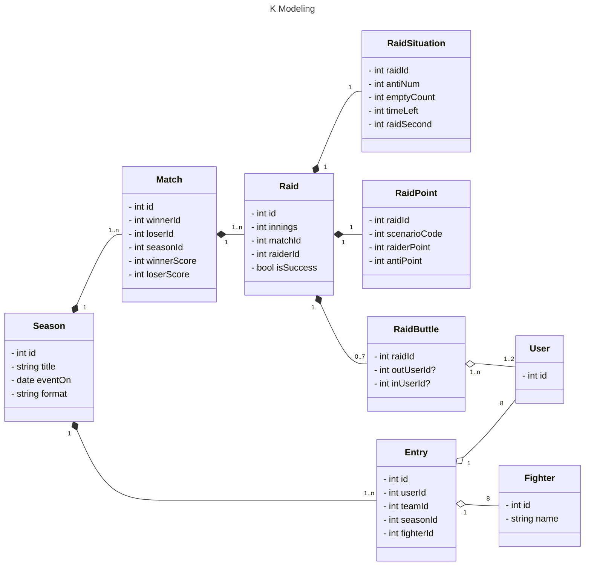

データの起点はレイドであり、プレイヤーではない。

```mermaid
---
title: K Modeling
---
classDiagram
    direction LR
    class Season{
      - int id
      - string title
      - date eventOn
      - string format
    }
    class Match{
      - int id
      - int winnerId
      - int loserId
      - int seasonId
      - int winnerScore
      - int loserScore
    }
    class User{
      - int id
    }
    class Fighter{
      - int id
      - string name
    }
    class Entry{
      - int id
      - int userId
      - int teamId
      - int seasonId
      - int fighterId
    }
    class Raid{
      - int id
      - int innings
      - int matchId
      - int raiderId
      - bool isSuccess
    }
    class RaidPoint{
      - int raidId
      - int scenarioCode
      - int raiderPoint
      - int antiPoint
    }
    class RaidSituation{
      - int raidId
      - int antiNum
      - int emptyCount
      - int timeLeft
      - int raidSecond
    }
    class RaidButtle{
      - int raidId
      - int outUserId?
      - int inUserId?
    }

    Season "1" *-- "1..n" Match
    Season "1" *-- "1..n" Entry
    Match "1" *-- "1..n" Raid
    Entry "1" o-- "8" User
    RaidButtle "1..n" o-- "1..2" User
    Raid "1" *-- "1" RaidSituation
    Raid "1" *-- "1" RaidPoint
    Raid "1" *-- "0..7" RaidButtle
    Entry "1" o-- "8" Fighter
```
