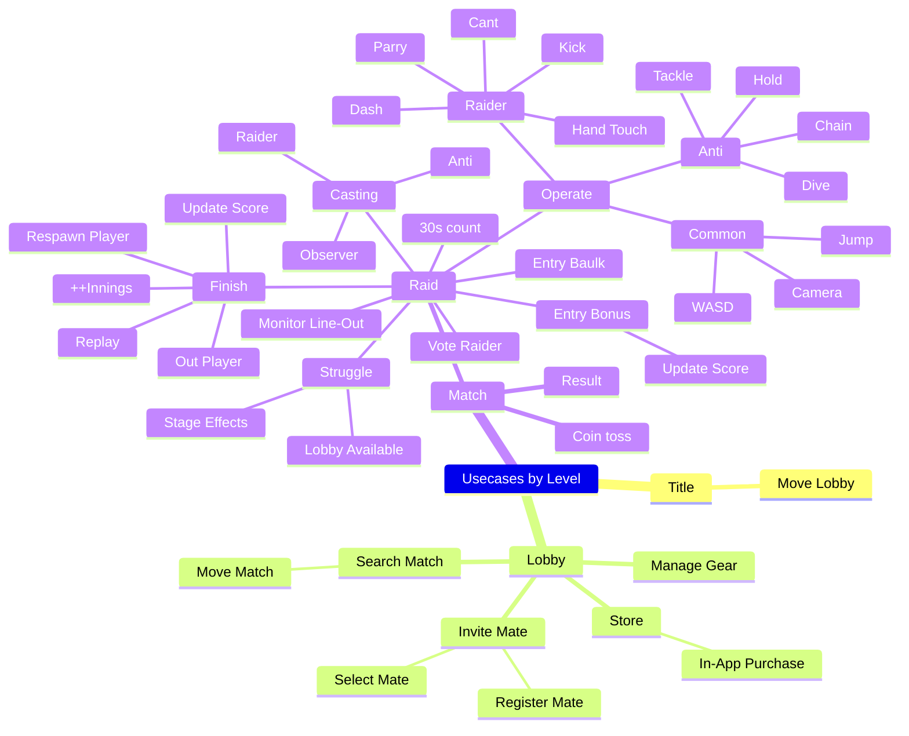

```mermaid
gantt
    title Git Issues - days since last update
    dateFormat X
    axisFormat %s
    section M1
      walk: 0, 10
      jump: 10, 20

    section M2
    t   : 0, 36
    section M3
    t   : 0, 34
    section M4
    t    : 0, 9
    section M5
    t    : 0, 5
```

```mermaid
mindmap
Usecases by Level
  Title
    Move Lobby
  Lobby
    Invite Mate
      Register Mate
      Select Mate
    Search Match
      Move Match
    Manage Gear
    Store
      In-App Purchase
  Match
    Coin toss
    Raid
      Vote Raider
      30s count
      Monitor Line-Out
      Casting
        Raider
        Observer
        Anti
      Operate
        Common
          WASD
          Jump
          Camera
        Raider
          Hand Touch
          Kick
          Dash
          Cant
          Parry
        Anti
          Hold
          Chain
          Dive
          Tackle
      Entry Baulk
      Entry Bonus
        Update Score
      Struggle
        Lobby Available
        Stage Effects
      Finish
        Update Score
        Out Player
        Respawn Player
        Replay
        ++Innings
    Result
```
